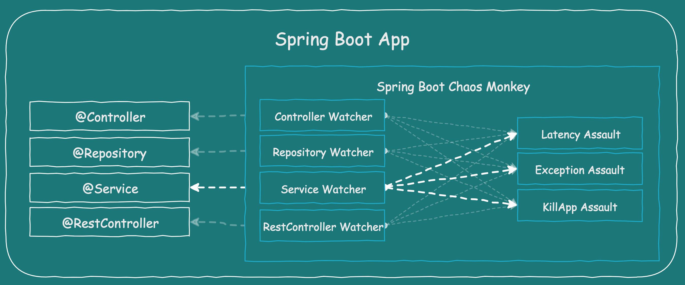

# Chaos experiments

Following you can read all the information about the chaos experiments defined in the project.

You can execute:

- chaos using shell scripts
- chaos using Spring Boot Chaos Monkey interacting directly with the framework
- Chaos using Chaos Toolkit and Spring Boot Chaos Monkey

## 1. Define steady states

Define a metric to check a steady state of your service and of course your entire system. Start small with a service that is not critical.

## 2. Do not start in production

Of course, you can start in production, but keep in mind…

> The best place on earth is…production!
> Josh Long

…so let’s keep production as the best place on earth and look for our first experiences on another stage. If all goes well, and you’re confident, run it in production.

## 3. Fire the Chaos Using Spring Boot Chaos Monkey

This project provides a Chaos Monkey for Spring Boot applications and will try to attack your running Spring Boot App.

> Everything from getting started to advanced usage is explained in the [Documentation for Chaos Monkey for Spring Boot](https://codecentric.github.io/chaos-monkey-spring-boot/latest/)

If Spring Boot Chaos Monkey is on your classpath and activated with profile name chaos-monkey, it will automatically hook into your application.

Now you can activate [watchers](https://codecentric.github.io/chaos-monkey-spring-boot/latest/#watchers), which look for classes to [assault](https://codecentric.github.io/chaos-monkey-spring-boot/latest/#assaults). There are also [runtime assaults](https://codecentric.github.io/chaos-monkey-spring-boot/latest/#runtime-assaults), which attack your whole application.



### Configure Spring Boot Chaos Monkey

The project comes with the Spring Boot Chaos Monkey configured for the following services:

* `customers-service`
* `visits-service`
* `vets-service`

Adding the following dependency:

```
  <!-- Chaos Monkey -->
  <dependency>
      <groupId>de.codecentric</groupId>
      <artifactId>chaos-monkey-spring-boot</artifactId>
  </dependency>
```

And activating the Spring Configuration at global level (`application.yml`):

```
# Chaos Engineering
---
spring:
  config:
    activate:
      on-profile: chaos-monkey
management.endpoint.chaosmonkey.enabled: true
chaos:
  monkey:
    enabled: true
    watcher:
      component: false
      controller: false
      repository: false
      rest-controller: false
      service: false
```

You can read more about the possible configuration options [here](https://codecentric.github.io/chaos-monkey-spring-boot/latest/#_properties).

### Spring Boot Chaos Monkey HTTP Endpoint

| ID                                     | Description                          | Methods |
| -------------------------------------- | ------------------------------------ | ------- |
| `/chaosmonkey`                         | Running Chaos Monkey configuration   | GET     |
| `/chaosmonkey/status`                  | Is Chaos Monkey enabled or disabled? | GET     |
| `/chaosmonkey/enable`                  | Enable Chaos Monkey                  | POST    |
| `/chaosmonkey/disable`                 | Disable Chaos Monkey                 | POST    |
| `/chaosmonkey/watchers`                | Running Watchers configuration.      | GET     |
| `/chaosmonkey/watchers`                | Change Watchers Configuration        | POST    |
| `/chaosmonkey/assaults`                | Running Assaults configuration       | GET     |
| `/chaosmonkey/assaults`                | Change Assaults configuration        | POST    |
| `/chaosmonkey/assaults/runtime/attack` | Execute configured runtime Assault   | POST    |

### Assault Example

`POST` Assaults

Request to enable Latency & Exception Assault

`/chaosmonkey/assaults` - Request

```
{
  "level": 5,
  "latencyRangeStart": 2000,
  "latencyRangeEnd": 5000,
  "latencyActive": true,
  "exceptionsActive": true,
  "killApplicationActive": false
}
```

`/chaosmonkey/assaults` - Response `200 OK`

```
Assault config has changed
```

Define specific method attacks

`/chaosmonkey/assaults` - Request

```
{
  "level": 5,
  "latencyRangeStart": 2000,
  "latencyRangeEnd": 5000,
  "latencyActive": true,
  "exceptionsActive": true,
  "killApplicationActive": false,
  "watchedCustomServices": [
    "com.example.chaos.monkey.chaosdemo.controller.HelloController.sayHello",
    "com.example.chaos.monkey.chaosdemo.controller.HelloController.sayGoodbye"
  ]
}
```

`/chaosmonkey/assaults` - Response `200 OK`

```
Assault config has changed
```

Define custom Exceptions

`/chaosmonkey/assaults` - Request

```
{
  "level": 5,
  "latencyRangeStart": 2000,
  "latencyRangeEnd": 5000,
  "latencyActive": true,
  "exceptionsActive": true,
  "killApplicationActive": false,
  "exception": {
    "type": "java.lang.IllegalArgumentException",
    "arguments": [
      {
        "className": "java.lang.String",
        "value": "custom illegal argument exception"
      }
    ]
  }
}
```

`/chaosmonkey/assaults` - Response `200 OK`

```
Assault config has changed
```

### Fire the Chaos Interacting Directly With Spring Boot Chaos Monkey

In order to active Spring Boot Chaos Monkey's assault options and component instrumentation, you need to call the project's API.

For your convenience we're providing a [script](./scripts/chaos) that turns on various watchers and attacks. To print out the usage description just call the script without any parameters.

```
$ ./chaos/chaos-monkey/call_chaos.sh
usage: ./scripts/chaos/call_chaos.sh: <customers|visits|vets> <attacks_enable_exception|attacks_enable_killapplication|attacks_enable_latency|attacks_enable_memory|watcher_enable_component|watcher_enable_controller|watcher_enable_repository|watcher_enable_restcontroller|watcher_enable_service|watcher_disable>
First pick either customers, visits or vets
Then pick what to enable. Order matters!
Example
./scripts/chaos/call_chaos.sh visits attacks_enable_exception watcher_enable_restcontroller
```

The script takes in at minimum 2 parameters.

 * First provides the name of the application for which you want to turn on Chaos Monkey features.
 * The subsequent ones will enable attacks and watchers.

The name of the desired feature maps to a json file that gets updated to `http://localhost:${PORT}/actuator/chaosmonkey/assaults` and `http://localhost:${PORT}/actuator/chaosmonkey/watchers` respectively. Example of enabling exception assault via rest controllers for the visits microservice:

```
$ ./call_chaos.sh customers attacks_enable_exception watcher_enable_restcontroller
```

or

```
$ ./call_chaos.sh visits attacks_enable_exception watcher_enable_restcontroller
```

The default assault configuration is set to fail every 5th request. That means that the first four will work as if Chaos Monkey was be disabled.

To sisable the attack execute the following command:

```
$ ./call_chaos.sh customers attacks_disable watcher_disable
```

or

```
$ ./call_chaos.sh visits attacks_disable watcher_disable
```

## 4. Fire the Chaos Using Chaos Toolkit & Spring Boot Chaos Monkey

[Chaos Toolkit](https://chaostoolkit.org/) have support for Chaos Monkey for Spring Boot so that you can run a variety of chaos engineering probes and actions against your Spring Boot applications and services including:

- __Enabling and Disabling the Chaos Monkey__ on a specific service at runtime (useful for turning on the Chaos Monkey support for only the duration of your chaos engineering experiment).
- __Enabling and Configuring chaos assaults__ on a specific service at runtime.
- __Inspecting and recording the configuration of the Chaos Monkey’s watcher and assaults__ through probes in your experiment. Useful for capturing this information for further analysis after your experiments conclude.

Install chaos toolkit. You can do it following the [official documentation](https://chaostoolkit.org/reference/usage/install/)

Set virtual environment in python and install [chaostoolkit-spring](https://chaostoolkit.org/drivers/spring/)

```
$ python3 -m venv ~/.venvs/chaostk
$ source  ~/.venvs/chaostk/bin/activate
$ pip install chaostoolkit-spring
```

Run the experiment:

```
chaos run ./chaos/chaos-toolkit/[service]/[experiments].json
```

You can find all the Chaos Toolkit experiments in `./chaos/chaos-toolkit`

## 5. Fire the Chaos Using Shell Scripts

You can execute additional chaos experiment using a collection of shell script located on `./chaos/chaos-scripts`.

To run the experiments, just execute any of the shell scripts and wait to the magic happens ;-)

## 6. Implement active application monitoring

Check your monitoring and check if you can see the overall state of your system. There are many great tools out there to get a pleasant feeling about your entire system.

## 7. References

- https://principlesofchaos.org/?lang=ENcontent
- https://medium.com/chaos-toolkit/chaos-toolkit-loves-chaos-monkey-for-spring-boot-548352985c8f
- https://www.linkedin.com/pulse/chaos-engineering-introduction-using-spring-boot-chellimuthu/
