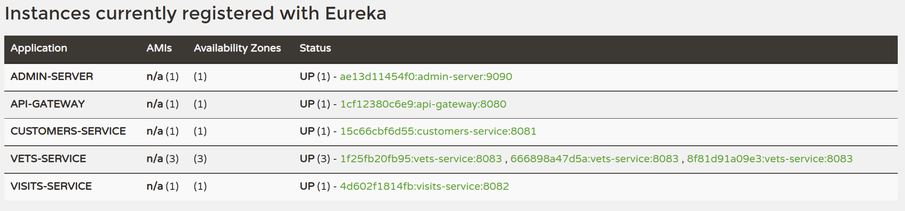

# Starting Services Locally with Docker & Docker Compose

In order to start entire infrastructure using Docker, you have to build images by executing

```
./mvnw clean install -P local,buildDocker
```

from a project root.

```bash
[INFO] ------------------------------------------------------------------------
[INFO] Reactor Summary:
[INFO] 
[INFO] spring-petclinic-microservices 2.6.1 ............... SUCCESS [  0.384 s]
[INFO] spring-petclinic-admin-server ...................... SUCCESS [01:14 min]
[INFO] spring-petclinic-customers-service ................. SUCCESS [ 34.380 s]
[INFO] spring-petclinic-vets-service ...................... SUCCESS [ 32.524 s]
[INFO] spring-petclinic-visits-service .................... SUCCESS [ 31.264 s]
[INFO] spring-petclinic-config-server ..................... SUCCESS [ 23.791 s]
[INFO] spring-petclinic-discovery-server .................. SUCCESS [ 32.297 s]
[INFO] spring-petclinic-api-gateway 2.6.1 ................. SUCCESS [ 42.558 s]
[INFO] ------------------------------------------------------------------------
[INFO] BUILD SUCCESS
[INFO] ------------------------------------------------------------------------
[INFO] Total time: 04:32 min
[INFO] Finished at: 2022-05-31T12:42:42+02:00
[INFO] ------------------------------------------------------------------------
```

Once the process is finished you can list the Docker images executing

```bash
docker images
```

```bash
→ docker images
REPOSITORY                                           TAG              IMAGE ID       CREATED          SIZE
springcommunity/spring-petclinic-api-gateway         latest           b05a5a8f1898   22 minutes ago   307MB
<none>                                               <none>           c8632915489f   23 minutes ago   435MB
springcommunity/spring-petclinic-discovery-server    latest           d3839d95a98e   23 minutes ago   299MB
<none>                                               <none>           f46941834a56   23 minutes ago   419MB
springcommunity/spring-petclinic-config-server       latest           f2089c9a4ff2   24 minutes ago   284MB
<none>                                               <none>           45e2e5f3beb8   24 minutes ago   391MB
springcommunity/spring-petclinic-visits-service      latest           cf983c5d8147   24 minutes ago   320MB
<none>                                               <none>           b7eb223fa3ab   24 minutes ago   462MB
springcommunity/spring-petclinic-vets-service        latest           5527f2af2f53   25 minutes ago   322MB
<none>                                               <none>           23403414e267   25 minutes ago   465MB
springcommunity/spring-petclinic-customers-service   latest           488f497859fb   25 minutes ago   320MB
<none>                                               <none>           6f0cd703cac0   25 minutes ago   462MB
springcommunity/spring-petclinic-admin-server        latest           0bebf3d62b98   26 minutes ago   298MB
<none>                                               <none>           e03af1b4764f   26 minutes ago   418MB
openjdk                                              11-jre           88444449fcf3   2 days ago       307MB
adoptopenjdk                                         11-jre-hotspot   2c57fb3bc67b   8 months ago     244MB
```

## Starting the Services

Once images are ready, you can start them with the following commands

```bash
docker network create observabilitysandbox
docker-compose up
```

or, if you prefer

```bash
make up
```

After starting services it takes a while for `API Gateway` to be in sync with service registry, so don't be scared of initial Zuul timeouts.

*NOTE: Under MacOSX or Windows, make sure that the Docker VM has enough memory to run the microservices. The default settings are usually not enough and make the `docker-compose up` painfully slow.*

## Services

The following services will be started. Some of them are accessible via web:

| Component                                  | Description                                                 | Port                               |
| ---------------------------------------    | --------------------------------------------------------    | -------------------------------    |
| `config-server`                            | Spring config server                                        | [`8888`](http://localhost:8888/)   |
| `discovery-server`                         | Spring discovery server                                     | [`8761`](http://localhost:8761/)   |
| `customers-service`                        | Customers service                                           | [`8081`](http://localhost:8081/)   |
| `visits-service`                           | Visits service                                              | [`8082`](http://localhost:8082/)   |
| `vets-service`                             | Vets service                                                | [`8083`](http://localhost:8083/)   |
| `api-gateway`                              | Api Gateway                                                 | [`8080`](http://localhost:8080/)   |
| `admin-server`                             | Admin server                                                | [`9091`](http://localhost:9091/)   |
| `load-server`                              | [Load generator based on Artillery](https://artillery.io/)  | N/A                                |

## Starting More than One Service Instance at the Same Time

If you want to execute more than one instance of, for example, Customer service you have to change the binding port to avoid conflicts. Comment the `ports` configuration parameter.

```yaml
...

#Vets service
vets-service:
  image: springcommunity/spring-petclinic-vets-service
  environment:
    - SPRING_PROFILES_ACTIVE=local,docker,chaos-monkey,elk
    #- SPRING_PROFILES_ACTIVE=docker,chaos-monkey
    - LOGSTASH_HOST=logstash
    - LOGSTASH_PORT=5044
  depends_on:
    - config-server
    - discovery-server
  entrypoint: ["./dockerize","-wait=tcp://discovery-server:8761","-timeout=300s","--","java", "org.springframework.boot.loader.JarLauncher"]
  #ports:
  #  - 8083:8083
  networks:
    - observabilitysandbox
  restart: always
  labels:
    org.label-schema.group: "observability"
  
...
```

Now you can execute the following command to scale up a service using Docker Compose ;-)

```bash
docker-compose scale vets-service=3
```

If you open now the [Eureka dashboard](http://localhost:8761/), you can check that now, we have three instance registered for the Vets Service.


