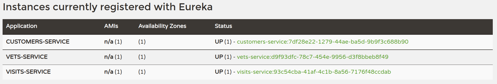

# Starting Services Locally with Docker

In order to start entire infrastructure using Docker, you have to build images by executing

```bash
./mvnw clean install -P local,buildDocker
```

from a project root.

```bash
[INFO] ------------------------------------------------------------------------
[INFO] Reactor Summary:
[INFO] 
[INFO] spring-petclinic-microservices 2.6.1 ............... SUCCESS [  0.384 s]
[INFO] spring-petclinic-admin-server ...................... SUCCESS [01:14 min]
[INFO] spring-petclinic-customers-service ................. SUCCESS [ 34.380 s]
[INFO] spring-petclinic-vets-service ...................... SUCCESS [ 32.524 s]
[INFO] spring-petclinic-visits-service .................... SUCCESS [ 31.264 s]
[INFO] spring-petclinic-config-server ..................... SUCCESS [ 23.791 s]
[INFO] spring-petclinic-discovery-server .................. SUCCESS [ 32.297 s]
[INFO] spring-petclinic-api-gateway 2.6.1 ................. SUCCESS [ 42.558 s]
[INFO] ------------------------------------------------------------------------
[INFO] BUILD SUCCESS
[INFO] ------------------------------------------------------------------------
[INFO] Total time: 04:32 min
[INFO] Finished at: 2022-05-31T12:42:42+02:00
[INFO] ------------------------------------------------------------------------
```

Once the process is finished you can list the Docker images executing

```bash
docker images
```

```bash
→ docker images
REPOSITORY                                           TAG              IMAGE ID       CREATED          SIZE
springcommunity/spring-petclinic-api-gateway         latest           b05a5a8f1898   22 minutes ago   307MB
<none>                                               <none>           c8632915489f   23 minutes ago   435MB
springcommunity/spring-petclinic-discovery-server    latest           d3839d95a98e   23 minutes ago   299MB
<none>                                               <none>           f46941834a56   23 minutes ago   419MB
springcommunity/spring-petclinic-config-server       latest           f2089c9a4ff2   24 minutes ago   284MB
<none>                                               <none>           45e2e5f3beb8   24 minutes ago   391MB
springcommunity/spring-petclinic-visits-service      latest           cf983c5d8147   24 minutes ago   320MB
<none>                                               <none>           b7eb223fa3ab   24 minutes ago   462MB
springcommunity/spring-petclinic-vets-service        latest           5527f2af2f53   25 minutes ago   322MB
<none>                                               <none>           23403414e267   25 minutes ago   465MB
springcommunity/spring-petclinic-customers-service   latest           488f497859fb   25 minutes ago   320MB
<none>                                               <none>           6f0cd703cac0   25 minutes ago   462MB
springcommunity/spring-petclinic-admin-server        latest           0bebf3d62b98   26 minutes ago   298MB
<none>                                               <none>           e03af1b4764f   26 minutes ago   418MB
openjdk                                              11-jre           88444449fcf3   2 days ago       307MB
adoptopenjdk                                         11-jre-hotspot   2c57fb3bc67b   8 months ago     244MB
```

## Starting the Config and Discovery Server

Please note that supporting services (__Config and Discovery Server__) must be started before any other application (Customers, Vets, Visits and API).

First, we'll create a Docker network to interconnect the Docker Containers

```bash
docker network create observabilitysandbox
```

Starting the Config Server

```bash
docker run -ti --network=observabilitysandbox -p 8888:8888 --name=config-server springcommunity/spring-petclinic-config-server
```

Note that you have to indicate:

- the `--network` parameter with the network name. In our case `observabilitysandbox`
- the `-p` parameter to indicate the ports to expose
- the `--name` parameter to indicate the name of the container. This parameter is very important to allow the container be able to resolve the network information

You can check that the service is up and running opening the following URL: [http://localhost:8888/](http://localhost:8888/)


Time to start the Discovery Server

```bash
docker run -ti --network=observabilitysandbox -p 8761:8761 --name=discovery-server springcommunity/spring-petclinic-discovery-server
```

You can check that the Discovery Server is up and running opening this URL: [http://localhost:8761/](http://localhost:8761/)


## Starting the Application Services

We start launching the core services (Customers, Vets and Visits) executing the following commands

```bash
docker run -ti --network=observabilitysandbox -p 8081:8081 --name=customers-service springcommunity/spring-petclinic-customers-service
docker run -ti --network=observabilitysandbox -p 8082:8082 --name=vets-service springcommunity/spring-petclinic-vets-service
docker run -ti --network=observabilitysandbox -p 8083:8083 --name=visits-service springcommunity/spring-petclinic-visits-service
```

You can check that the services are registered in the Discovery Server in the following URL: [http://localhost:8761/](http://localhost:8761/)



Once the core services are running, it's time to start the Api Gateway. You can do it executing the following command

```bash
docker run -ti --network=observabilitysandbox -p 8080:8080 --name=api-gateway springcommunity/spring-petclinic-api-gateway
```

Again, you can check in the Eureka server that the new service is registered at [http://localhost:8761/](http://localhost:8761/)


At this point you can check that the application is running going to the URL: [http://localhost:8080/](http://localhost:8080/)


## Services

The following services will be started. Some of them are accessible via web:

| Component                                  | Description                                                 | Port                               |
| ---------------------------------------    | --------------------------------------------------------    | -------------------------------    |
| `config-server`                            | Spring config server                                        | [`8888`](http://localhost:8888/)   |
| `discovery-server`                         | Spring discovery server                                     | [`8761`](http://localhost:8761/)   |
| `customers-service`                        | Customers service                                           | [`8081`](http://localhost:8081/)   |
| `visits-service`                           | Visits service                                              | [`8082`](http://localhost:8082/)   |
| `vets-service`                             | Vets service                                                | [`8083`](http://localhost:8083/)   |
| `api-gateway`                              | Api Gateway                                                 | [`8080`](http://localhost:8080/)   |

## Starting More than One Service Instance at the Same Time

If you want to execute more than one instance of, for example, Customer service you have to change the binding port and the name to avoid conflicts

```bash
docker run -ti --network=observabilitysandbox -p 8084:8081 --name=customers-service-2 springcommunity/spring-petclinic-customers-service
```

If you don't need to access to any port of the services containers, and you don't need to resolve the network configuration, you can execute the Docker images without specifing the name and the port configuration. 

You can kill the service Docker containers (Customers, Vets and Visits) and execute the following commands

```bash
docker run -ti --network=observabilitysandbox springcommunity/spring-petclinic-customers-service
docker run -ti --network=observabilitysandbox springcommunity/spring-petclinic-vets-service
docker run -ti --network=observabilitysandbox springcommunity/spring-petclinic-visits-service
```

Now you can execute the second instance of Customer service without problems ;-)

```bash
docker run -ti --network=observabilitysandbox springcommunity/spring-petclinic-customers-service
```

If you open now the [Eureka dashboard](http://localhost:8761/), you can check that now, we have two instance registered for the Customer Service.


