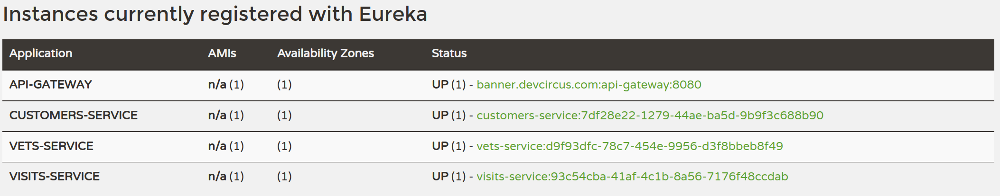
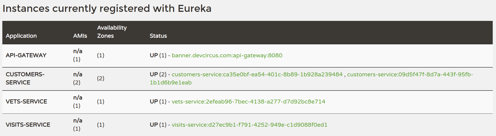

# Starting Services Locally without Docker

In order to start entire infrastructure, you have to build the project by executing

```bash
./mvnw clean install -Plocal 
```

from a project root.

```bash
[INFO] ------------------------------------------------------------------------
[INFO] Reactor Summary:
[INFO] 
[INFO] spring-petclinic-microservices 2.6.1 ............... SUCCESS [  0.493 s]
[INFO] spring-petclinic-admin-server ...................... SUCCESS [  6.452 s]
[INFO] spring-petclinic-customers-service ................. SUCCESS [ 11.180 s]
[INFO] spring-petclinic-vets-service ...................... SUCCESS [  9.712 s]
[INFO] spring-petclinic-visits-service .................... SUCCESS [  9.087 s]
[INFO] spring-petclinic-config-server ..................... SUCCESS [  8.210 s]
[INFO] spring-petclinic-discovery-server .................. SUCCESS [ 11.544 s]
[INFO] spring-petclinic-api-gateway 2.6.1 ................. SUCCESS [ 25.376 s]
[INFO] ------------------------------------------------------------------------
[INFO] BUILD SUCCESS
[INFO] ------------------------------------------------------------------------
[INFO] Total time: 01:23 min
[INFO] Finished at: 2022-05-31T11:13:38+02:00
[INFO] ------------------------------------------------------------------------
```

## Starting the Config and Discovery Server

Please note that supporting services (__Config and Discovery Server__) must be started before any other application (Customers, Vets, Visits and API).

Starting the Config Server

```bash
cd spring-petclinic-config-server
../mvnw spring-boot:run -Plocal 
```

```bash
2022-05-31 11:15:48.984  INFO 23305 --- [           main] o.s.b.a.w.s.WelcomePageHandlerMapping    : Adding welcome page: class path resource [static/index.html]
2022-05-31 11:15:49.688  INFO 23305 --- [           main] o.s.b.w.embedded.tomcat.TomcatWebServer  : Tomcat started on port(s): 8888 (http) with context path ''
2022-05-31 11:15:49.711  INFO 23305 --- [           main] o.s.s.p.config.ConfigServerApplication   : Started ConfigServerApplication in 3.623 seconds (JVM running for 4.069)
```

You can check that the service is up and running opening the following URL: [http://localhost:8888/](http://localhost:8888/)


Time to start the Discovery Server

```bash
cd spring-petclinic-discovery-server
../mvnw spring-boot:run -Plocal 
```

```bash
2022-05-31 11:16:29.151  INFO 23524 --- [           main] o.s.b.w.embedded.tomcat.TomcatWebServer  : Tomcat initialized with port(s): 8761 (http)
2022-05-31 11:16:29.482  INFO 23524 --- [           main] o.apache.catalina.core.StandardService   : Starting service [Tomcat]
2022-05-31 11:16:29.483  INFO 23524 --- [           main] org.apache.catalina.core.StandardEngine  : Starting Servlet engine: [Apache Tomcat/9.0.55]
2022-05-31 11:16:29.671  INFO 23524 --- [           main] o.a.c.c.C.[Tomcat].[localhost].[/]       : Initializing Spring embedded WebApplicationContext
2022-05-31 11:16:29.671  INFO 23524 --- [           main] w.s.c.ServletWebServerApplicationContext : Root WebApplicationContext: initialization completed in 1928 ms
```

You can check that the Discovery Server is up and running opening this URL: [http://localhost:8761/](http://localhost:8761/)


## Starting the Application Services

We start launching the core services (Customers, Vets and Visits)

Every microservice is a Spring Boot application and can be started locally using IDE or executing

```bash
cd spring-petclinic-customers-service; ../mvnw spring-boot:run -Plocal 
cd spring-petclinic-vets-service; ../mvnw spring-boot:run -Plocal 
cd spring-petclinic-visits-service; ../mvnw spring-boot:run -Plocal 
```

command. Remember to enable the `local` Maven profile.

You can check that the services are registered in the Discovery Server in the following URL: [http://localhost:8761/](http://localhost:8761/)


Once the core services are running, it's time to start the Api Gateway. You can do it executing the following command

```bash
cd spring-petclinic-api-gateway; ../mvnw spring-boot:run -Plocal 
```

Again, you can check in the Eureka server that the new service is registered at [http://localhost:8761/](http://localhost:8761/)



At this point you can check that the application is running going to the URL: [http://localhost:8080/](http://localhost:8080/)


## Services

The following services will be started. Some of them are accessible via web:

| Component                                  | Description                                                 | Port                               |
| ---------------------------------------    | --------------------------------------------------------    | -------------------------------    |
| `config-server`                            | Spring config server                                        | [`8888`](http://localhost:8888/)   |
| `discovery-server`                         | Spring discovery server                                     | [`8761`](http://localhost:8761/)   |
| `customers-service`                        | Customers service                                           | Random                             |
| `visits-service`                           | Visits service                                              | Random                             |
| `vets-service`                             | Vets service                                                | Random                             |
| `api-gateway`                              | Api Gateway                                                 | [`8080`](http://localhost:8080/)   |

## Starting More than One Service Instance at the Same Time

If you review the service log, you can check that each service started with a random port. This is to avoid port conflict in the host.

```bash
2022-05-31 12:06:47.234  INFO 27276 --- [  restartedMain] o.s.b.a.e.web.EndpointLinksResolver      : Exposing 17 endpoint(s) beneath base path '/actuator'
2022-05-31 12:06:47.309  INFO 27276 --- [  restartedMain] o.s.b.w.embedded.tomcat.TomcatWebServer  : Tomcat started on port(s): 42695 (http) with context path ''
2022-05-31 12:06:47.311  INFO 27276 --- [  restartedMain] .s.c.n.e.s.EurekaAutoServiceRegistration : Updating port to 42695
```

This behaviors is configured in the application.yml file stored in the git config repository of the project

```yaml
# COMMON APPLICATION PROPERTIES
server:
  # start services on random port by default
  port: 0
  
...
```

So you can open a new terminal and start any of the service many times as you want. For example:

```bash
cd spring-petclinic-customers-service; ../mvnw spring-boot:run -Plocal 
```

If you open now the [Eureka dashboard](http://localhost:8761/), you can check that now, we have two instance registered for the Customer Service.


